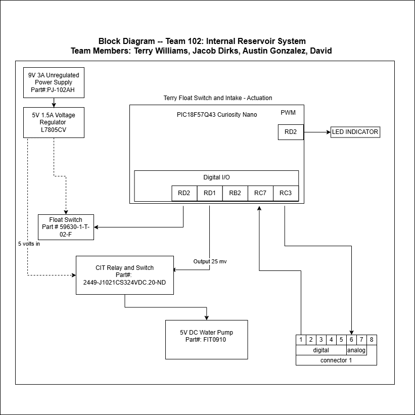

## Team Information 

## Overview
Internal Reservoir system - Sensor/Actuator

My Segment of the project will be on on the internal resovoir system which will control water intake. A Float switch will be used to determine internal reservoir water level, when the tank in low the switch will actuate the intake pump for external water tank to fill internal reservoir. This will send a downstream signal to the fertilizer stirring system, prompting it to start. 

Team connections:

## Block Diagram 

