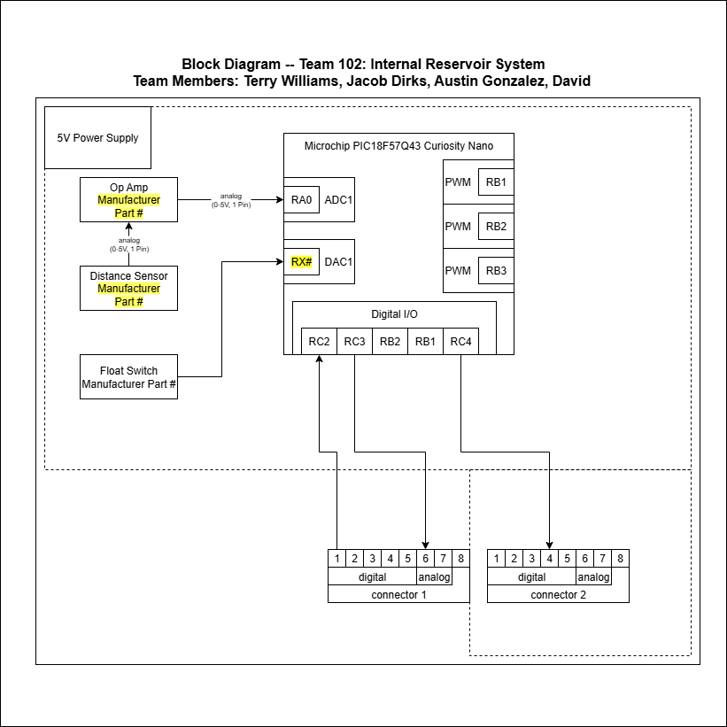

## Team Information 

## Overview
Internal Reservoir system - Sensor/Actuator

Float Style tank level to determine internal reservoir water level, actuates intake pump for external water tank to fill internal reservoir. Actuates stirring for fertilizer prompted by the fertilizer system. 

Team connections:

    Water Distribution Pump - Actuation 
    Fertilizer- Sensor/Actuator
    Moisture Sensor for the soil - Sensor

## Block Diagram 

