### Float Switch

##

1. 59630-1-T-02-A 	
SENSOR LEVEL SWITCH SINGLE FLOAT

    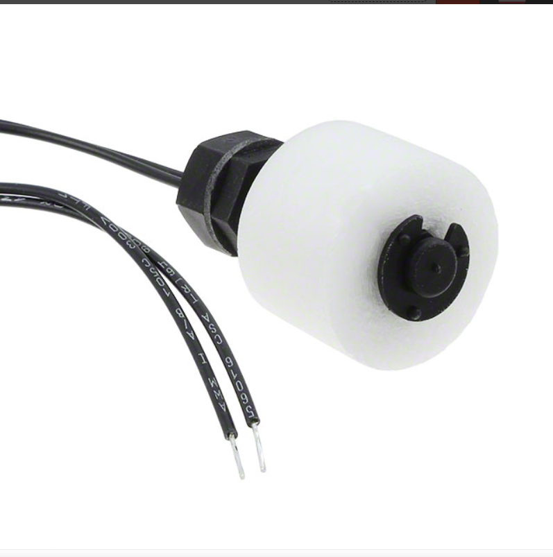

    * $7.99/each
    * [link to product](https://www.digikey.com/en/products/detail/littelfuse-inc/59630-1-T-02-A/4771999?gclsrc=aw.ds&gad_source=1&gad_campaignid=20509825838&gbraid=0AAAAADrbLlhgS6gBiX18_P1FSC4Ya6Ls5&gclid=CjwKCAjwr8LHBhBKEiwAy47uUm2amo2He_7OUOuz4vKCIkU70yORPZDnrcjj5UW6E_2C8vhyiks2WhoCF10QAvD_BwE)

    | Pros                                      | Cons                                                             |
    | ----------------------------------------- | ---------------------------------------------------------------- |
    | Realitivly Inexpensive                               | Requires external components and support circuitry for interface |
    | Normally Open Switch                      | No option for closed switch                                    |
    | Meets constraint of project | Requires Set up |

    

2. LS02-1A66-PA-500W Float Switch

    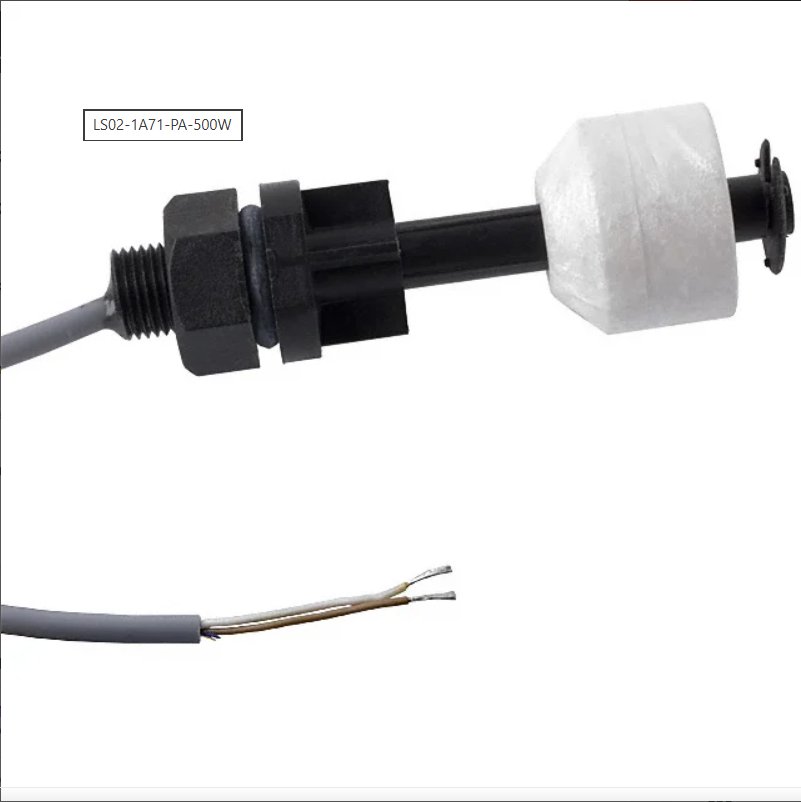

    * $4.17/each
    * [Link to product](https://www.digikey.com/en/products/detail/standex-meder-electronics/LS02-1A66-PA-500W/385415?gclsrc=aw.ds&gad_source=1&gad_campaignid=20232005509&gbraid=0AAAAADrbLliL8TzXuQg7x9tLNvO4PqNgi&gclid=CjwKCAjwr8LHBhBKEiwAy47uUmjZq440IywNQ2jzZLL1ziGtNA4FLnNz39L1NnW2fEzmiRx9LQ9PThoCPxgQAvD_BwE)

    | Pros                                                              | Cons                |
    | ----------------------------------------------------------------- | ------------------- |
    | Cheaper Item                                             | Cheaper Quality      |
    | Single Switch                                 | Slow shipping speed |
    | Direct interface with PSoC (no external circuitry required) range |

3. SPST Liquid Level Switch Selectable 240 VAC 100 PSI

    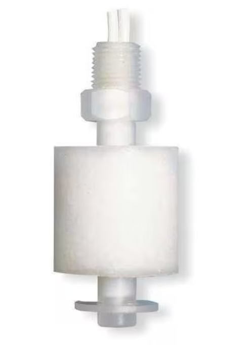

    * $13.49/each
    * [Link to product](https://www.zoro.com/madison-spst-liquid-level-switch-selectable-240-vac-100-psi-m8000/i/G2923024/?utm_source=google&utm_medium=surfaces&utm_campaign=shopping%20feed&utm_content=free%20google%20shopping%20clicks&campaignid=21413729702&productid=G2923024&v=&gclsrc=aw.ds&gad_source=1&gad_campaignid=21407283336&gbraid=0AAAAADw3hZfk1_4-rLG86Cs8Xprx4fCAb&gclid=CjwKCAjw0sfHBhB6EiwAQtv5qelPiJLWtLxb2EKBoslzb5jkatH57YSqIPhER1bej1qQrGuu4tblihoCkIAQAvD_BwE)

    | Pros                                                              | Cons                |
    | ----------------------------------------------------------------- | ------------------- |
    | Most Expensive Item                                             | Unnessarcy for project purposes     |
    | Higher Quality                                | Primarily for sump pump |
    | Selectable swith function |

**Choice:** Option 1

**Rationale:** Most affordable option, while keeping necessary functions for project purposes. Easy to set up with PCB board. Normally open switch witch better fits project needs.
    

### Distance Sensor

##

1. GP2Y0A02YK IR distance sensor

    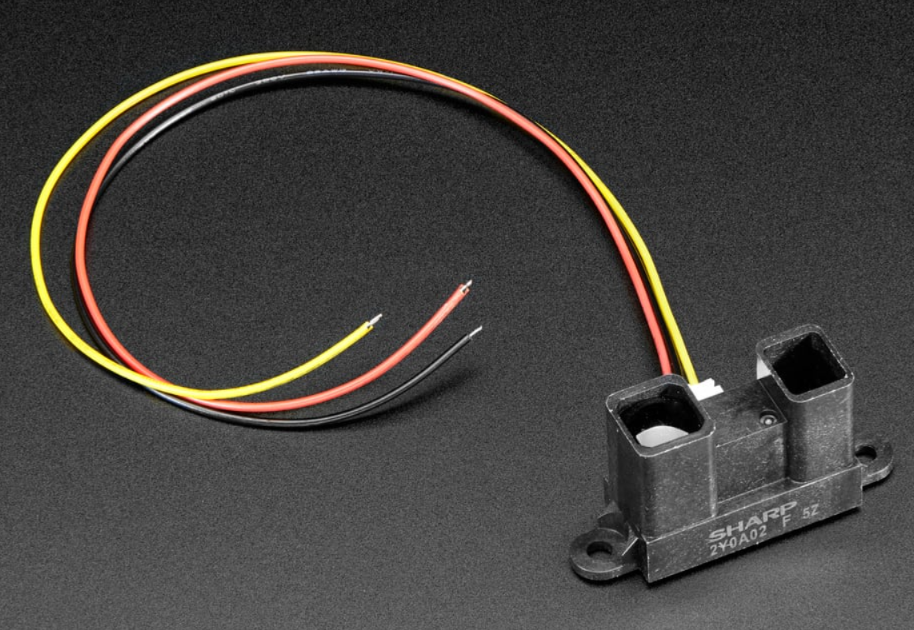

    * $15.95/each
    * [link to product](https://www.adafruit.com/product/1031?srsltid=AfmBOorHVEuRcvJDb0hgWnEOFo2RQEIurTxpeCe6L7a8ChlFM19YCw_CT3Q)

    | Pros                                      | Cons                                                             |
    | ----------------------------------------- | ---------------------------------------------------------------- |
    | Easy to use                               | Limited sensing ability  |
    | Wires provided                      | Provided wire length could be to short                                    |
    | Meets constraint of project | Requires Set up |

2. US-100 Ultrasonic Distance Sensor

    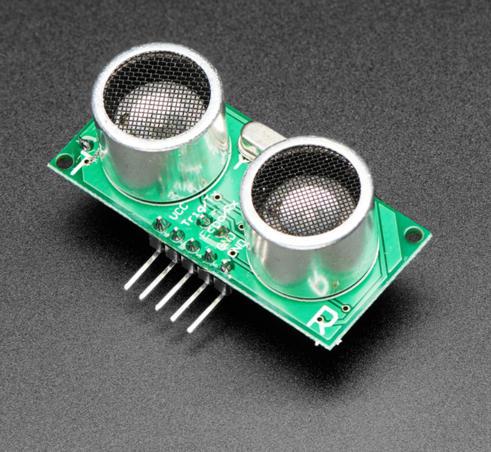

    * $6.95/each
    * [link to product](https://www.adafruit.com/product/4019?srsltid=AfmBOorcofCH4LlJqW5Vi7eFcd4CITPBMmQ11tQFrbpdJ9Fq_n5zTHmnO0k)

    | Pros                                      | Cons                                                             |
    | ----------------------------------------- | ---------------------------------------------------------------- |
    | Ultrasonic                               | Limited sensing ability  |
    | Compatible with UART                      | Wires not include                                  |
    | Meets constraint of project | Requires Set up |
    | 3V or 5V |  |

3. A02YYUW Waterproof Ultrasonic

    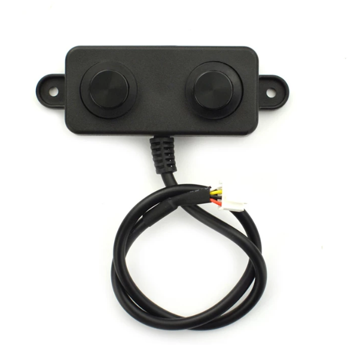

    * $15.90/each
    * [link to product](https://www.dfrobot.com/product-1935.html?gad_source=1&gad_campaignid=22388643497&gbraid=0AAAAADucPlCf621YrQL7uQgeE4_kYrGTu&gclid=CjwKCAjw0sfHBhB6EiwAQtv5qSpDfXVuR8JJMEG4pZYCFG_XARhxNm5k30hxdU9pZ-6TwBOj9GS9qBoCI-cQAvD_BwE)

    | Pros                                      | Cons                                                             |
    | ----------------------------------------- | ---------------------------------------------------------------- |
    | Ultrasonic                               | Might require extra setup  |
    | Submersible ideal for home projects                       |                    |
    | Meets constraint of project | Requires Set up |
    | 3V or 5V |  |
    | Wires come attached | 

 
**Choice:** Option 3

**Rationale:** Option fits many user needs, is submersible and waterproof, compatible with UART, Comes with Wires attached, Durable and high quality, able to withstand wide range of temperature. 

### Water Pump

##

1. FIT0910 	Water Intake Pump

    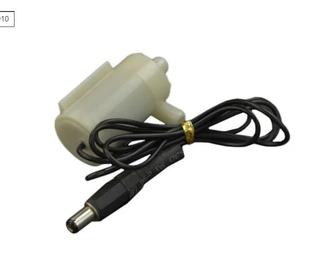

    * $7.99/each
    * [link to product](https://www.digikey.com/en/products/detail/dfrobot/FIT0910/18069285)

    | Pros                                      | Cons                                                             |
    | ----------------------------------------- | ---------------------------------------------------------------- |
    | 3 - 6v safe operating voltage                              | Requires external components and support circuitry for interface |
    | One connecter wire                      | have to cut wire                                    |
    | Meets constraint of project | Requires Set up |

    

2. 4546 SUBMERSIBLE 3VDC HORIZONTAL PUMP

    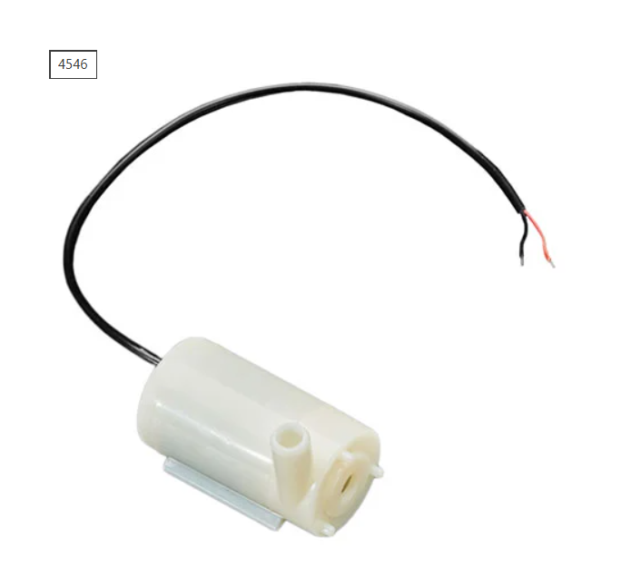

    * $2.95/each
    * [Link to product](https://www.digikey.com/en/products/detail/adafruit-industries-llc/4546/11627740?gclsrc=aw.ds&gad_source=1&gad_campaignid=20228387720&gbraid=0AAAAADrbLlidVOsd5u8Z8e0XY83cd9tRl&gclid=Cj0KCQjwsPzHBhDCARIsALlWNG0PZXjeoJvH4RzNMrnGGUbS6D2mSQA8k3OgYfPlTMTcDFGF2gk8Pq8aAqs4EALw_wcB)

    | Pros                                                              | Cons                |
    | ----------------------------------------------------------------- | ------------------- |
    | 3 Volts DC                                             | Cheaper Quality      |
    | 2 wire                                 | Low current |
    |  | Not much information on product

3. Olimex LTD Micro Water Pump

    

    * $3.53/each
    * [Link to product](https://www.digikey.com/en/products/detail/olimex-ltd/MICRO-WATER-PUMP/21662046?gclsrc=aw.ds&gad_source=1&gad_campaignid=20228387720&gbraid=0AAAAADrbLlidVOsd5u8Z8e0XY83cd9tRl&gclid=Cj0KCQjwsPzHBhDCARIsALlWNG2ZRvozK4zGPyObUU8HkuX8aiXh95goKfnFmKOMitNb9uZEGsdhaicaAq0fEALw_wcB)

    | Pros                                                              | Cons                |
    | ----------------------------------------------------------------- | ------------------- |
    | Capable of reaching 30 GPH target                                            | Unnessarcy for project purposes     |
    | Works at 9V from supply                               | Requires Connector |
    | Cheap | No filtering

**Choice:** Option 1

**Rationale:** Capable of running off of 5 volts, which is perfect for the scope of the project, intakes water at a good rate.

### Voltage Regulator

##

1. L7805CV	

    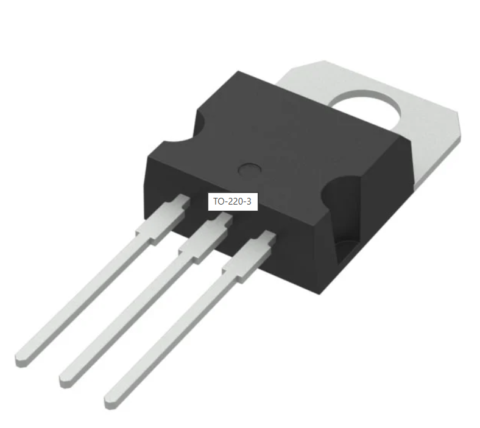

    * 0.50/each
    * [link to product](https://www.digikey.com/en/products/detail/stmicroelectronics/L7805CV/585964?gclsrc=aw.ds&gad_source=1&gad_campaignid=20228387720&gbraid=0AAAAADrbLlidVOsd5u8Z8e0XY83cd9tRl&gclid=Cj0KCQjwsPzHBhDCARIsALlWNG2V09HetNL3l8QpYvWw4KMgAhdhMJerjx_B7vWUj3ZPqoJH5pSxQIgaAjY8EALw_wcB)

    | Pros                                      | Cons                                                             |
    | ----------------------------------------- | ---------------------------------------------------------------- |
    | Realitivly Inexpensive                               | Requires external components and support circuitry for interface |
    | Max input 35v                | No option for closed switch                                    |
    | Meets constraint of project | Requires Set up |

    

2. LM7805CT/NOPB 

    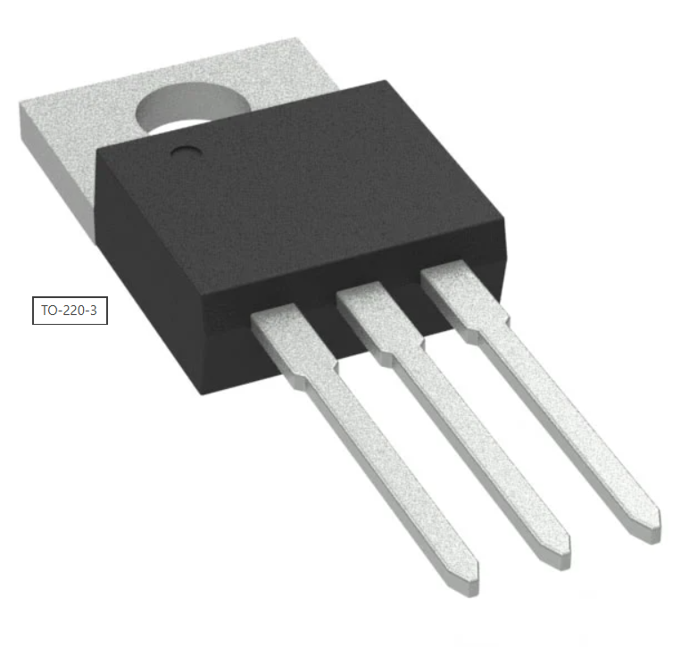

    * $1.80/each
    * [Link to product](https://www.digikey.com/en/products/detail/texas-instruments/LM7805CT-NOPB/3901929?gclsrc=aw.ds&gad_source=1&gad_campaignid=20228387720&gbraid=0AAAAADrbLlidVOsd5u8Z8e0XY83cd9tRl&gclid=Cj0KCQjwsPzHBhDCARIsALlWNG2rUEtYLqRIWR4gKatfL7OWrXjdHvzFVYpVgIk_ye9696JUMLn7n80aAiXCEALw_wcB)

    | Pros                                                              | Cons                |
    | ----------------------------------------------------------------- | ------------------- |
    | Included in Kit                                           | Could be slightly oversized      |
    | Single Switch                                 | Slow shipping speed |
    | 35 V input max |

3. LM334Z/NOPB Voltage regulator

    

    * $0.89/each
    * [Link to product](https://www.digikey.com/en/products/detail/texas-instruments/LM334Z-NOPB/6215?gclsrc=aw.ds&gad_source=1&gad_campaignid=20228387720&gbraid=0AAAAADrbLlidVOsd5u8Z8e0XY83cd9tRl&gclid=Cj0KCQjwsPzHBhDCARIsALlWNG2sMB1KTZsUU08U2QJZiS7wg3JbH3BC5kjuac5uN8e2_8JWX2TNxBEaAnWREALw_wcB)

    | Pros                                                              | Cons                |
    | ----------------------------------------------------------------- | ------------------- |
    | Inexpensive Item                                             | Unnessarcy for project purposes     |
    | Higher Quality                                | Wrong type of Regulator |
    | Max input current of 40V |

**Choice:** Option 2

**Rationale:** Pricing is negligible for these components, however the LM7805 is included in group kits, it has the ratings for the needs of this project, and it can be easily replaced.

### Mosfet

1. AOTF2618L	
N-CHANNEL MOSFET 60V 16A TO220F (AOTF2618L)

    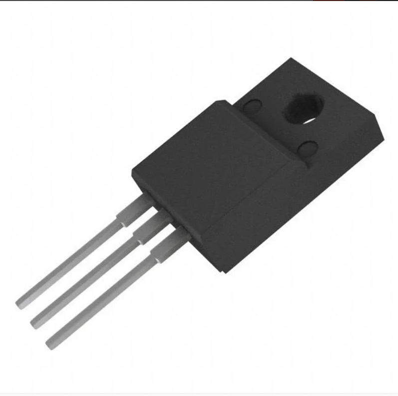

    * 1.66/each
    * [link to product](https://www.digikey.com/en/products/detail/alpha-omega-semiconductor-inc/AOTF2618L/3603382?gclsrc=aw.ds&gad_source=1&gad_campaignid=120565755&gbraid=0AAAAADrbLlhCXftiJluGgUch6rsfE1-Oc&gclid=Cj0KCQjwvJHIBhCgARIsAEQnWlDh4hwHc2N-KVPvaTVzfUOCX2Zy4rsaT5qtnUZxYQA08sWHxIfVx6MaAjw7EALw_wcB)

    | Pros                                      | Cons                                                             |
    | ----------------------------------------- | ---------------------------------------------------------------- |
    | Realitivly Inexpensive                               | Slower manufacter time  |
    | Drain to source 60v                | No option for closed switch                                    |
    | Meets constraint of project |  |

    

2. IRFZ34NPBF

    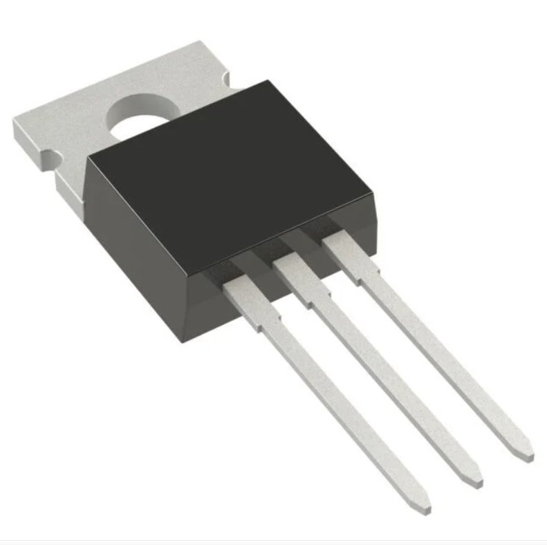

    * $0.49/each
    * [Link to product](https://www.digikey.com/en/products/detail/infineon-technologies/IRFZ34NPBF/811724?gclsrc=aw.ds&gad_source=1&gad_campaignid=20228387720&gbraid=0AAAAADrbLlhXJGfcEhRJDyWePw_CeOxJv&gclid=Cj0KCQjwvJHIBhCgARIsAEQnWlAUJ9E3lL24Soqhn-f7Fi-ZYl0rbLiTAYRZdJd6ew_EnW9mZhf4Z9EaAswuEALw_wcB)

    | Pros                                                              | Cons                |
    | ----------------------------------------------------------------- | ------------------- |
    | Easy to implement                                            | Could be slightly oversized      |
    |Fufils requirements                                 | Slow shipping speed |
    |  |

3. IMW120R060M1HXKSA1 

    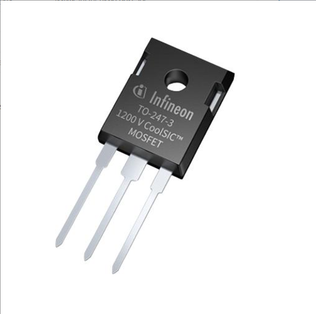

    * $10.23/each
    * [Link to product](https://www.newark.com/infineon/imw120r060m1hxksa1/mosfet-n-ch-1-2kv-36a-175deg-c/dp/29AH1032?CMP=KNC-GUSA-PMAX-SHOPPING-ONBOARD-COMP-NEW&mckv=_dc|pcrid||plid||kword||match||slid||product|29AH1032|pgrid||ptaid||&gad_source=1&gad_campaignid=22957739450&gbraid=0AAAAAD5U_g0dBa8DYR6a3WIhUq1sdOOnR&gclid=Cj0KCQjwvJHIBhCgARIsAEQnWlDRqicohwMvShzdqmIEjhAWPEDbU_-4Ip6ePA_I0LAxn0UaS1x-zooaAjdgEALw_wcB)

    | Pros                                                              | Cons                |
    | ----------------------------------------------------------------- | ------------------- |
    | Easy to implement                                             | Unnessarcy for project purposes     |
    | Higher Quality                                | Wrong type of Mosfet |
    | Max input current of 20V |Higher price

**Choice:** Option 1

**Rationale:** Pricing is negligible for these components, however the AOTF2618L is included in group kits, it has the ratings for the needs of this project, and it can be easily replaced if damaged or less.

### Rotary Encoder

1. 410-117	

    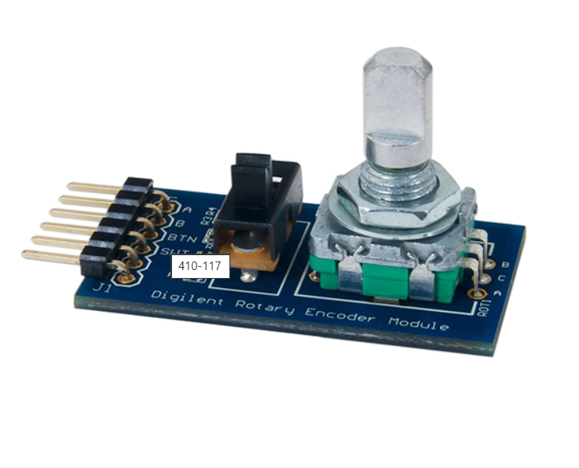

    * 6.99/each
    * [link to product](https://www.digikey.com/en/products/detail/digilent-inc/410-117/4090075?gclsrc=aw.ds&gad_source=1&gad_campaignid=20243136172&gbraid=0AAAAADrbLljBrwbEOOOI5QeKsQyheYgRa&gclid=Cj0KCQjw9obIBhCAARIsAGHm1mSh5J85sdF8BSGlujqDx3Rd6DnuvCSICvQpar7WsEnbfGv_Ri_AMBYaAsx4EALw_wcB)

    | Pros                                      | Cons                                                             |
    | ----------------------------------------- | ---------------------------------------------------------------- |
    | Comes with circuitry    | Requires external components and support circuitry for interface |
    | Highest Quality                | No Includes extra board                                    |
    | Mutiple functions| Requires to much Set up |

    

2. PEC11R-4220F-N0024

    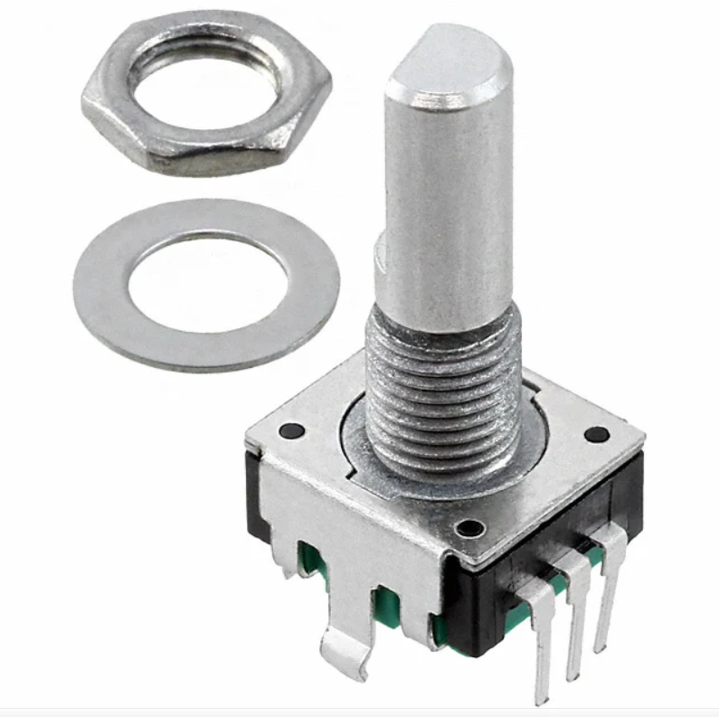

    * $1.89/each
    * [Link to product](https://www.digikey.com/en/products/detail/bourns-inc/PEC11R-4220F-N0024/4699220?gclsrc=aw.ds&gad_source=1&gad_campaignid=20232005509&gbraid=0AAAAADrbLljkY1rSUW1C0ZlylesrT5yW_&gclid=Cj0KCQjwvJHIBhCgARIsAEQnWlCXjK1KhB21siIk0jyaypcTsQFHN_L2WYbFzyIhkihg6G78PE8CXcMaAgeKEALw_wcB)

    | Pros                                                              | Cons                |
    | ----------------------------------------------------------------- | ------------------- |
    | includes washer                                         | Could be hard to implement      |
    | No push button                                | Slow shipping speed |
    | Good price |

3. EC11J

    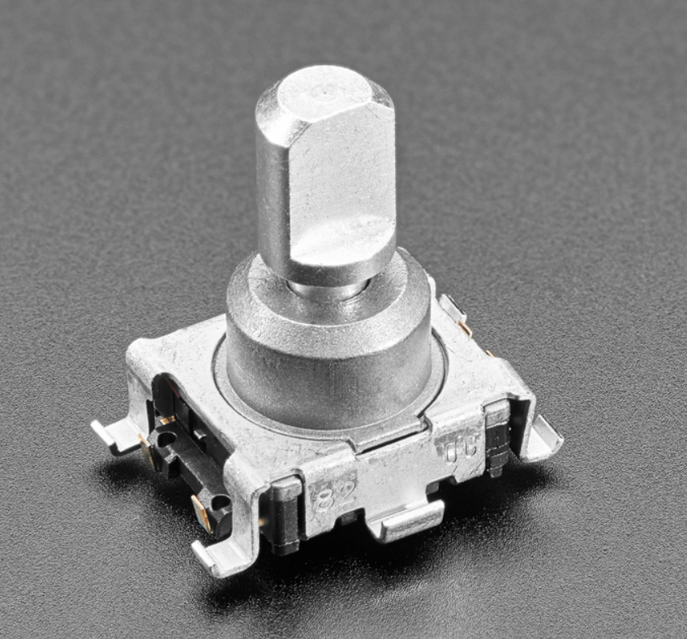

    * $4.50/each
    * [Link to product](https://www.adafruit.com/product/5454?srsltid=AfmBOoqCGnW79cHoJnijvrKx7CmTfJyEYjUG-OLOEEiNY2s6f4HqLJ9ITFE)

    | Pros                                                              | Cons                |
    | ----------------------------------------------------------------- | ------------------- |
    | Inexpensive Item                                             | Unnessarcy for project purposes     |
    | Higher Quality                                |Wrong type of connection points |
    | Built in Push button |

**Choice:** Option 2

**Rationale:** The PEC11R-4220F-N0024 is inexpensive and fufills the function for our team project. 

