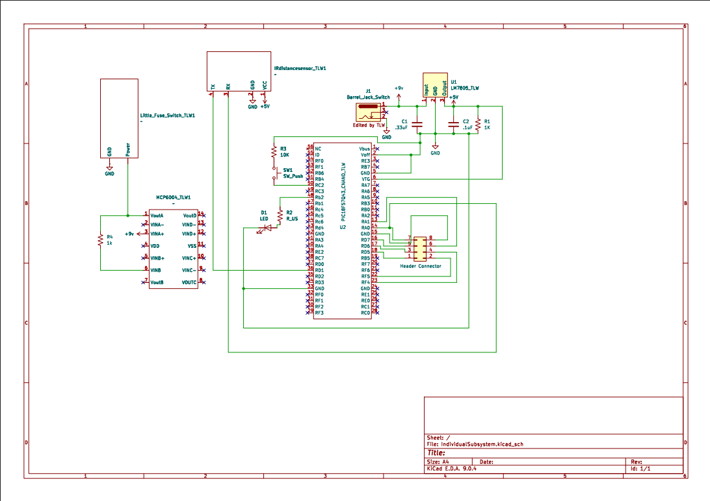

## Float Switch Schematic

This schematic is design to support a ultrasonic sensor for water tank level and a water tank float switch. 

{style width:"350" height:"300;"}
**Figure ##:** IndivdualSubsystem schematic.

