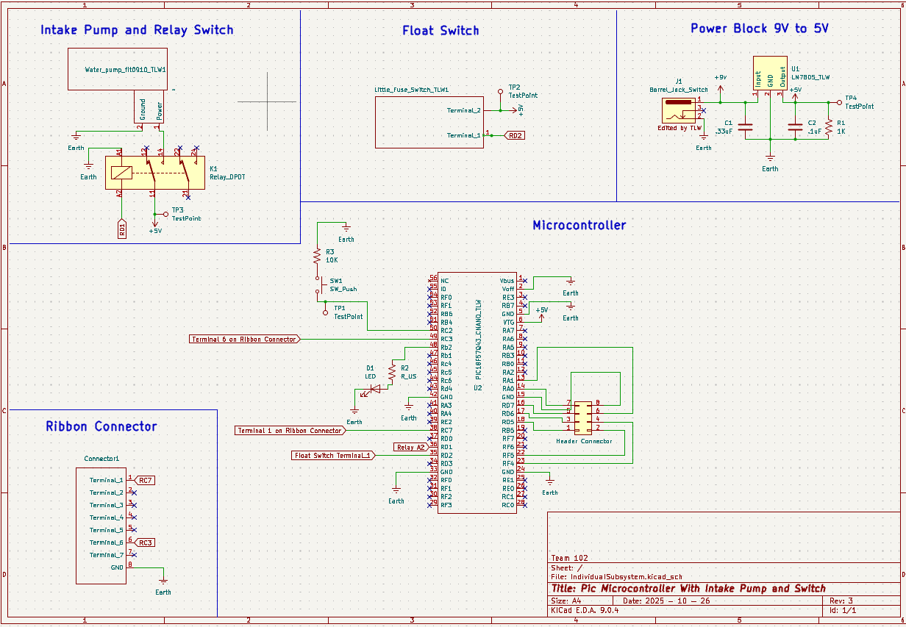
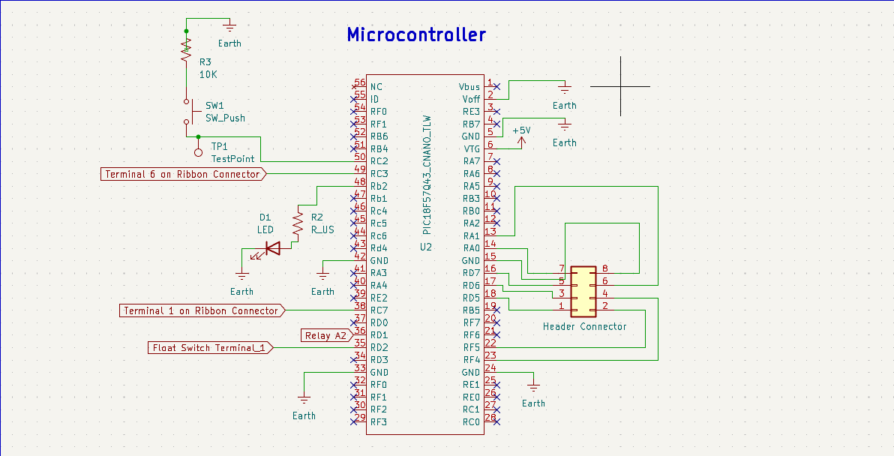
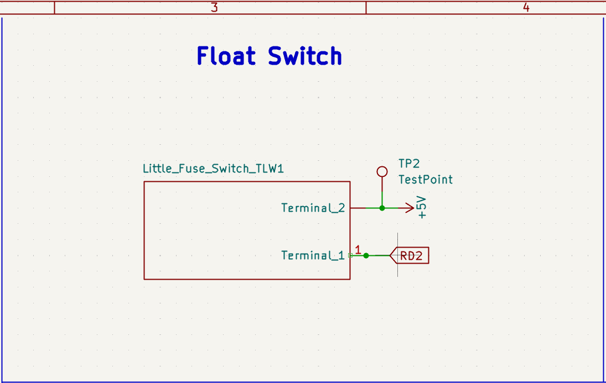
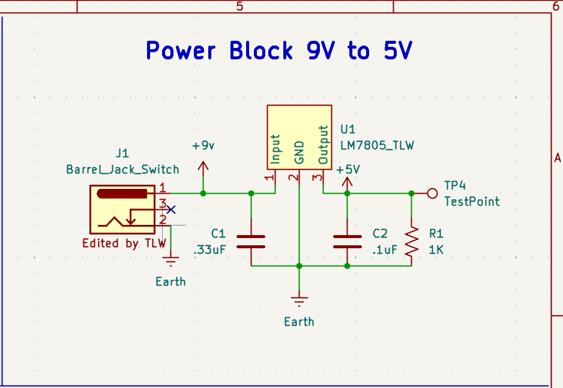
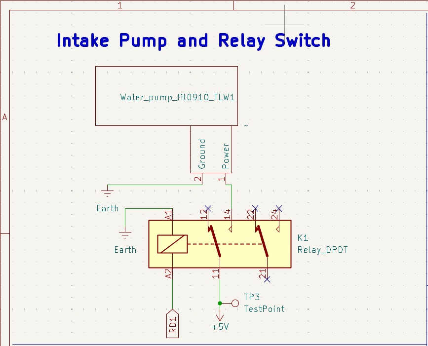
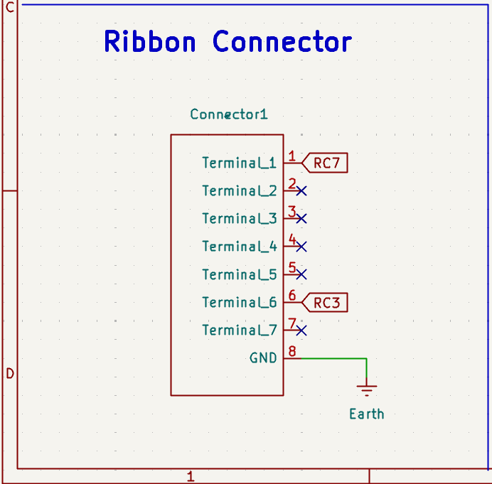

## Float Switch Schematic

This is a shematic of our projects water intake pump it uses a float switch to determine when the circuit will close actuating the water intake pump when the tank is full the Microcontroller will send a downstream signal to the water distributor. 

**Figure 1:** IndivdualSubsystem Full schematic.

**Figure 2:** IndivdualSubsystem Microcontroller.

**Figure 3:** IndivdualSubsystem Floatswitch.

**Figure 4:** IndivdualSubsystem Powerblock.

**Figure 5:** IndivdualSubsystem Intake Pump.

**Figure 6:** IndivdualSubsystem Ribbon Connector.

## Resources

The schematic is available as a pdf file, and the project is available as a zip folder.

