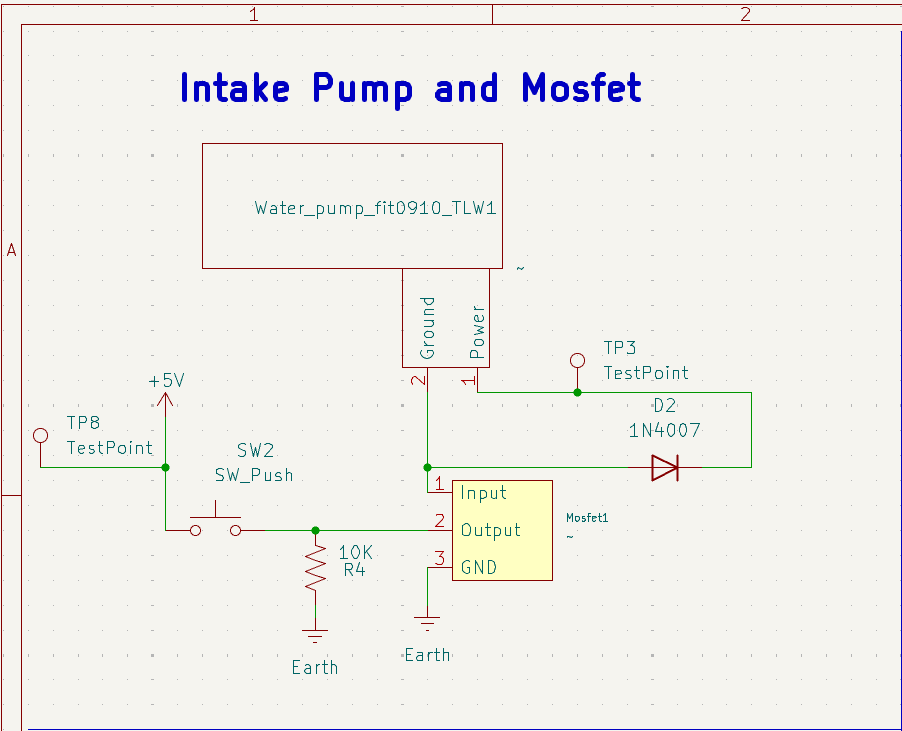

## Float Switch Schematic

This is a shematic of our projects water intake pump it uses a Ir Sensor/Emitter to determine when the circuit will close actuating the water intake pump when the tank is full(a schematic for a float switch is included however it is not used) the Microcontroller will send a downstream signal to the water distributor. The LCD was removed due to footprint issues

**Figure 1:** IndivdualSubsystem Full schematic.

**Figure 2:** IndivdualSubsystem Microcontroller.

**Figure 3:** IndivdualSubsystem Floatswitch.

**Figure 4:** IndivdualSubsystem Powerblock.

**Figure 5:** IndivdualSubsystem Intake Pump.

**Figure 6:** IndivdualSubsystem Rotary Encoder.

**Figure 8:** IndivdualSubsystem Ribbon Connector.

**Figure 9:** IndivdualSubsystem Ir Sensor/emitter.

## Resources

The PCB is available as a PDF [here](IndividualSubsystem(3).pdf), and the GERBER files available as a zip folder [here](IndividualSubsystem(2).zip).

