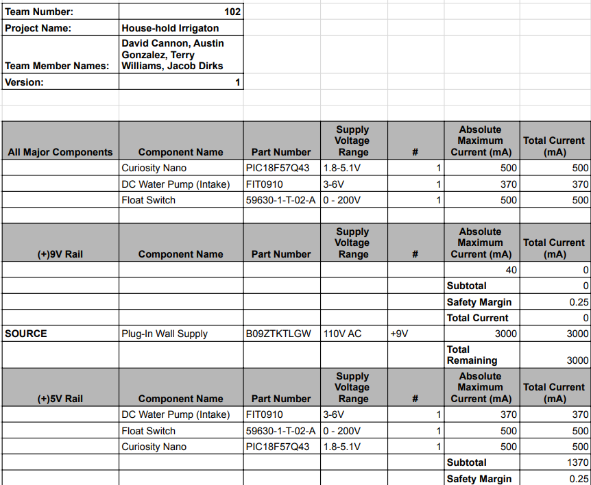
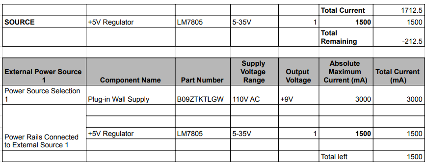

## Overview
After selecting components in Component Selection we needed to ensure that the subsection would have the power it needs with the added requirement of a safety margin. Therefore, we took the active components, meaning we excluded switches and passive components, and ensured our power supply as well as our regulators were able to get the power needed. The specifications for each piece came from their datasheet except in the case of the motor where it will only get power through the motor driver so it has different tolerances.

## Conclusions

From the prepare Power Budget, I noticed that with the saftey margin applied my current is not enough, however my components do not need to run all at the same time, so the design works out. 

## Resouces

The power budget as a PDF download is available [*here*](), and a Microsoft Excel Sheet [*here*](PowerBudgetExample.xlsx).