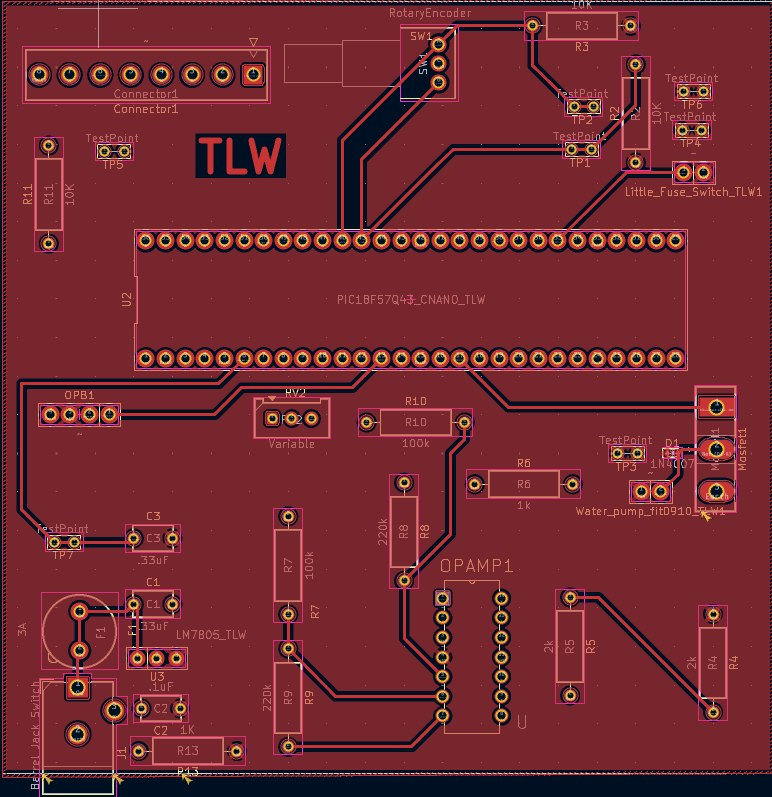

## Overview

This is a PCB of our projects water intake pump it uses a Ir Sensor/Emitter to determine when the circuit will close actuating the water intake pump when the tank is full(a schematic and footprint for a float switch is included however it is not used) the Microcontroller will send a downstream signal to the water distributor. 

**Figure 1:** Front Copper.

**Figure 2:** Back Copper.

## Resources

The PCB is available as a PDF [here](PCBforGIT.pdf), and the GERBER files available as a zip folder [here](GERBER.zip).

